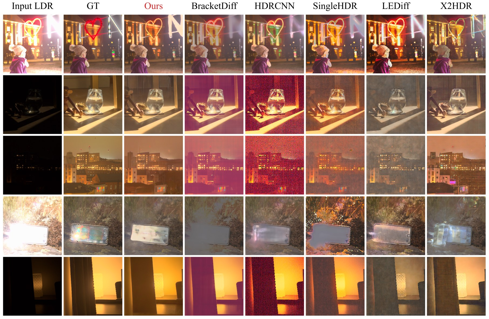

# Vid2HDRImg

Recasting single-shot HDR image reconstruction as conditional video
generation: a video diffusion model synthesises an exposure bracket from
a single LDR input, and a lightweight U-Net fuses the bracket into the
final HDR image.

<p align="center">
  
</p>

## Abstract

Recent generative methods for single-shot HDR image reconstruction show
promising results, but often struggle with preserving fidelity to the
input image: they hallucinate content, require separate models to handle
highlights and shadows, or sacrifice interpretability by directly
predicting the final HDR image. We address these limitations by
re-casting single-shot HDR reconstruction as conditional video generation
followed by a light-weight fusion of the generated frames. Given a
single LDR input, we fine-tune a video diffusion model to generate an
LDR image bracket with monotonically increasing exposures, and then
fuse the generated frames using a lightweight U-Net that predicts
per-pixel weights. This formulation is simple, interpretable, and
effective: rather than directly hallucinating an HDR image, it
explicitly reconstructs the intermediate exposure stack and fuses it
into the final output. Our method eliminates the need for separate
models across exposure regimes and produces HDR reconstructions with
high input fidelity. On quantitative benchmarks, our method achieves
state-of-the-art results on several reconstruction metrics, and human
evaluators prefer our results in 72% of pairwise comparisons against
existing methods. The framework also generalises beyond HDR to other
computational imaging tasks, including all-in-focus image recovery
from a single defocus-blurred input.

## What's in this repo

| path | what |
|---|---|
| `scripts/inference.py` | Single-image HDR inference (raw EXR or sRGB JPG/PNG). |
| `scripts/train_video_model.py` | Stage 1 — fine-tune SVD UNet to synthesise exposure brackets. |
| `scripts/train_fusion_net.py` | Stage 2 — train the lightweight pixel-space fusion U-Net. |
| `scripts/src/dataset_hdr.py` | Datasets: synthetic-bracket (`RepeatedHDRVideoDataset`) and raw-pair (`RawHDRPairDataset`). |
| `scripts/src/pipelines/pipeline_stable_video_diffusion_hdr.py` | The HDR-conditioned SVD inference pipeline. |
| `scripts/src/models/fusion_unet.py` | The fusion U-Net + helpers (`load_fusion_net`, `run_fusion_net_float`). |

## Installation

PyTorch is *not* listed in `requirements.txt` because the right wheel
depends on your GPU stack. **Install PyTorch first**, then everything
else with pip:

```bash
# 1. PyTorch — pick ONE matching your stack:
# CUDA 12.1
pip install torch==2.3.1 torchvision==0.18.1 \
    --index-url https://download.pytorch.org/whl/cu121
# ROCm 6.0  (the configuration the model was trained on)
pip install torch==2.3.1+rocm6.0 torchvision==0.18.1+rocm6.0 \
    --index-url https://download.pytorch.org/whl/rocm6.0
# CPU-only (debugging / inference only, very slow)
pip install torch==2.3.1 torchvision==0.18.1 \
    --index-url https://download.pytorch.org/whl/cpu

# 2. Everything else
pip install -r requirements.txt
```

Detailed step-by-step instructions:

- AMD ROCm: [docs/INSTALL_AMD.md](docs/INSTALL_AMD.md) *(the original training environment)*
- NVIDIA CUDA: [docs/INSTALL_CUDA.md](docs/INSTALL_CUDA.md)

The model and inference code rely on PyTorch SDPA only — no FlashAttention
or BitsAndBytes — so they run on either backend without code changes.

## Pretrained checkpoints

Download from the HuggingFace Hub:

```bash
huggingface-cli download chinmay0301/Vid2HDRImg --local-dir weights/
```

This pulls a directory layout like:

```
weights/
├── unet/                 # fine-tuned SVD UNet (Stage 1)
└── fusion_net.pt         # fusion U-Net (Stage 2)
```

> The base SVD model (the VAE / scheduler / image encoder used by Stage 1)
> is downloaded automatically from `stabilityai/stable-video-diffusion-img2vid`
> the first time you run inference.

## Inference (single image)

```bash
python scripts/inference.py \
    --input            example.jpg \
    --unet_path        weights/unet \
    --fusion_net_path  weights/fusion_net.pt \
    --output           predicted.exr
```

A bash wrapper is also provided that exposes the most common knobs as
env vars:

```bash
UNET_PATH=weights/unet \
FUSION_NET_PATH=weights/fusion_net.pt \
    bash scripts/run_inference.sh example.jpg predicted.exr
```

The script auto-detects the input type from the file extension: `.exr` /
`.hdr` are treated as **linear raw** (matches the training preprocessing);
`.png` / `.jpg` / `.jpeg` / `.tif` are treated as **sRGB** and linearised
by `img ** 2.2` before the same downstream preprocessing. Override with
`--input_type {raw,srgb}`.

Useful options:

| flag | default | what |
|---|---|---|
| `--num_frames` | 5 | Number of LDR frames in the synthesised bracket. |
| `--num_inference_steps` | 50 | Diffusion sampler steps. |
| `--width / --height` | 512 / 512 | Inference resolution. |
| `--peak_lum` | 4000 | Peak luminance (cd/m²) the predicted HDR is scaled to. |
| `--max_guidance_scale` | 1.0 | CFG max scale (1.0 = no guidance, recommended). |
| `--device` | cuda | Use `cpu` for debugging without a GPU. |

Run `python scripts/inference.py --help` for the full list.

## Training

Two-stage pipeline. See [docs/TRAINING.md](docs/TRAINING.md) for full commands
and dataset preparation. In short, the bash wrappers expose the common knobs
via env vars:

```bash
# Stage 1 — fine-tune SVD UNet
TRAIN_DATA_PATH=/path/to/hdr_dataset \
    bash scripts/run_train_video_model.sh

# Stage 2 — train the fusion U-Net
TRAIN_DATA_PATH=/path/to/hdr_dataset \
    bash scripts/run_train_fusion_net.sh
```

Or invoke the underlying Python scripts directly via
`accelerate launch scripts/train_*.py ...` — see TRAINING.md for full flag
listings. Dataset preparation pointers are in [docs/DATA.md](docs/DATA.md).

## Beyond HDR

The recipe — **recast an image-reconstruction task as conditional video
generation, then fuse the generated frames** — is not specific to HDR.
The same formulation applies to any inverse problem where the desired
image can be recovered by synthesising and fusing a physically meaningful
image stack. We show in the paper that the framework extends to
all-in-focus image recovery from a single defocus-blurred input, and
expect it to apply to other computational-photography problems with the
same temporal-stack structure (e.g. focal stacks, motion-deblur stacks,
multi-spectral captures).

## License

Code is released under the [MIT License](LICENSE). The pretrained Stable
Video Diffusion weights used as our starting point are subject to
Stability AI's licence terms; see the
[SVD model card](https://huggingface.co/stabilityai/stable-video-diffusion-img2vid)
for details.

